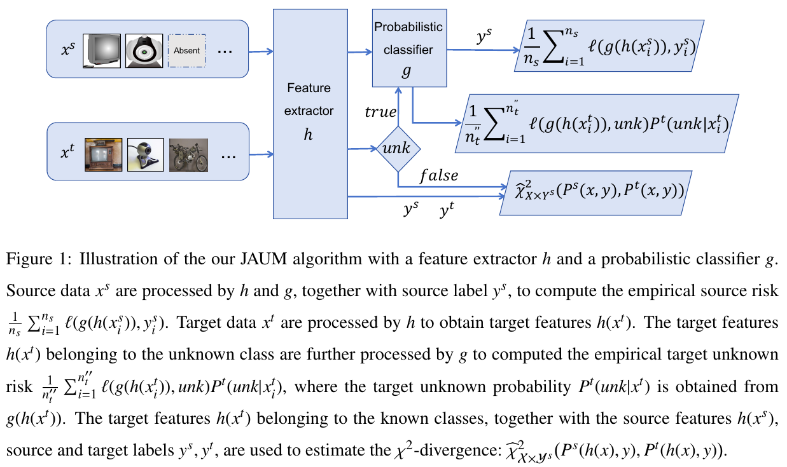

# Joint-Distribution-Alignment-and-Unknown-Risk-Minimization (JAUM)

This repository provides the PyTorch code for the work "Open-Set Domain Adaptation by Joint Distribution Alignment and Unknown Risk Minimization" published in Pattern Recognition, 2026. The introductory video for this work will soon be available at Bilibili.



In this work, we address the Open-Set Domain Adaptation (OSDA) problem. The problem aims to generalize a classification model from a source domain (source joint distribution) to a different target domain (target joint distribution), where the target domain contains the unknown class. To achieve the OSDA goal, a good target classification model should be learned by minimizing the target risk. In this work, we show that the model's target risk is upper bounded by (1) its source risk, (2) the $\chi^{2}$-divergence between the source joint distribution and the target known joint distribution, and (3) the target unknown risk. Building on this theoretical risk bound, we propose a Joint Distribution Alignment and Unknown Risk Minimization (JAUM) algorithm (see Fig.1 for the illustration). Our JAUM algorithm optimizes the classification model's parameters by minimizing (1) the empirical source risk, (2) the empirical $\chi^{2}$-divergence, and (3) the empirical target unknown risk, all of which can be computed from the empirical data. 


#### Dataset folder
The folder structure required (e.g OfficeHome)
- data
  - OfficeHome
    - list
      - Art_25.txt
      - Art.txt
      - Clipart_25.txt
      - Clipart.txt
      - Product_25.txt
      - Product.txt
      - Real_25.txt
      - Real.txt
    - Art
    - Clipart
    - Product
    - Real

##### How to run

```bash
python demo.py --root_dir ./data/OfficeHome --dataset officehome --source Real --target Product --seed 0 --gpu 0 --phase pretrain | tee OSDA-officehome_R2P_seed0_pre.log
python demo.py --root_dir ./data/OfficeHome --dataset officehome --source Real --target Product --seed 0 --gpu 0 | tee OSDA-officehome_R2P_seed0.log
```


For more details of this open-set domain adaptation approach,  please refer to the following work:

@article{Wen2026Open,    
title = {Open-Set Domain Adaptation by Joint Distribution Alignment and Unknown Risk Minimization},    
journal = {Pattern Recognition},    
volume = {174},    
pages = {113013},    
year = {2026},   
url = {https://www.sciencedirect.com/science/article/pii/S0031320325016760},   
author = {Lisheng Wen and Sentao Chen and Lin Zheng and Ping Xuan}   
}

  
The PyTorch code is currently maintained by Lisheng Wen. If you have any questions regarding the code, please contact Lisheng Wen via the email lishengwenmail@126.com.


